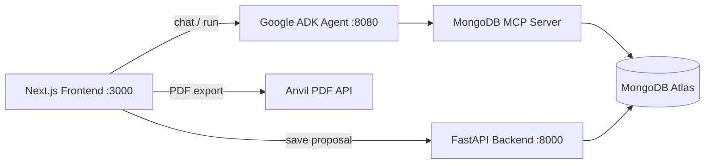

# DealPilot — AI Sales Proposal Agent

**Google Cloud Rapid Agent Hackathon · MongoDB Partner Track**

DealPilot is an autonomous AI sales agent that turns discovery call transcripts into winning business proposals. It analyzes client needs, searches similar past projects in MongoDB Atlas, generates a tailored proposal with Gemini, and saves results for future reuse.

Built with **Google ADK (Agent Builder)**, **Gemini**, and **MongoDB MCP** integration.

---

## Demo flow

1. Paste a discovery call transcript (or click **Load sample**).
2. The agent runs a transparent **3-step pipeline**:
   - **Step 1 — Analyzer:** Extract industry, company size, pain points, timeline, budget.
   - **Step 2 — Researcher:** Query MongoDB for similar historical projects.
   - **Step 3 — Generator:** Write an 800–1200 word professional proposal.
3. View results as **plain text** or export a **PDF** via the Anvil API.
4. Proposals are **auto-saved** to MongoDB Atlas.

---

## Architecture



| Layer | Technology | Port |
|-------|------------|------|
| Frontend | Next.js 16, React 19, Tailwind CSS 4 | 3000 |
| Agent | Google ADK (`dealpilot`) + Gemini | 8080 |
| MCP | FastMCP server → MongoDB Atlas | stdio |
| Backend | FastAPI (save API + fallback pipeline) | 8000 |
| Database | MongoDB Atlas `proposaldb` | cloud |

---

## Features

- **Multi-step agentic pipeline** — plans and executes analyze → research → generate under user oversight
- **MongoDB MCP tools** — search projects, save proposals, list recent proposals, aggregate stats
- **Chat UI** — ADK-style interface with tool-call visibility and quick prompts
- **Auto-save** — generated proposals persist to the `proposals` collection
- **Dual output** — plain-text proposal or PDF download (Anvil)
- **Fallback mode** — FastAPI 3-step Gemini pipeline when ADK is unavailable

---

## Prerequisites

- **Python 3.11+**
- **Node.js 20+**
- **MongoDB Atlas** cluster (free tier works)
- **Google AI Studio API key** (Gemini)
- **Anvil API key** (optional — PDF export; dev key is free with watermark)

---

## Quick start

### 1. Clone and configure

```powershell
git clone https://github.com/MujiburRahman1/business-proposal-agent.git
cd business-proposal-agent
```

Copy environment files and add your keys:

```powershell
# Backend
copy backend\.env.example backend\.env

# Agent
copy agent\dealpilot\.env.example agent\dealpilot\.env

# Frontend
copy frontend\.env.local.example frontend\.env.local
```

### 2. Backend setup

```powershell
cd backend
python -m venv .venv
.\.venv\Scripts\pip install -r requirements.txt
.\.venv\Scripts\python seed_db.py
```

### 3. Agent setup

```powershell
cd agent
.\scripts\start_agent.ps1
```

Opens the ADK web UI at **http://127.0.0.1:8080** — select **dealpilot** from the dropdown.

### 4. Start backend API (MongoDB save)

In a new terminal:

```powershell
cd backend
.\.venv\Scripts\uvicorn main:app --reload --port 8000
```

### 5. Start frontend

In a new terminal:

```powershell
cd frontend
npm install
npm run dev
```

Open **http://localhost:3000**

---

## Environment variables

### `backend/.env`

| Variable | Description |
|----------|-------------|
| `GEMINI_API_KEY` | Google AI Studio API key |
| `GEMINI_MODEL` | Default: `gemini-2.5-flash` |
| `MONGODB_URI` | MongoDB Atlas connection string |
| `MONGODB_DATABASE` | Default: `proposaldb` |

### `agent/dealpilot/.env`

| Variable | Description |
|----------|-------------|
| `GOOGLE_API_KEY` | Gemini API key for ADK |
| `GOOGLE_GENAI_USE_VERTEXAI` | `FALSE` for AI Studio, `TRUE` for Vertex AI |
| `MDB_MCP_CONNECTION_STRING` | MongoDB Atlas URI (official MCP variable name) |
| `MONGODB_DATABASE` | Default: `proposaldb` |
| `GEMINI_MODEL` | Default: `gemini-2.5-flash` |

### `frontend/.env.local`

| Variable | Description |
|----------|-------------|
| `ADK_AGENT_URL` | ADK agent URL (default `http://127.0.0.1:8080`) |
| `ADK_APP_NAME` | Agent name: `dealpilot` |
| `USE_ADK_AGENT` | `true` = ADK agent, `false` = FastAPI fallback |
| `BACKEND_URL` | FastAPI URL for MongoDB save (default `http://127.0.0.1:8000`) |
| `ANVIL_API_KEY` | Anvil PDF generation API key |

---

## MongoDB MCP tools

The agent connects to MongoDB via a custom MCP server at `backend/mcp_server.py`:

| Tool | Purpose |
|------|---------|
| `search_similar_projects` | Find past projects by industry |
| `find_documents` | Query any collection with a filter |
| `save_proposal` / `insert_document` | Save generated proposal to `proposals` |
| `list_recent_proposals` | List latest saved proposals |
| `aggregate_documents` | Project stats by industry |

### Database collections

**`projects`** — seeded case studies (industry, description, outcome, budget)

**`proposals`** — saved generated proposals with requirements and timestamps

### Seed the database

```powershell
cd backend
.\.venv\Scripts\python seed_db.py
```

### Test MCP tools locally

```powershell
cd backend
.\.venv\Scripts\python scripts\test_mcp.py
```

---

## Agent test commands

Try these in the chat UI or ADK web UI:

```
Find logistics projects in the database
```

```
Show me the 3 most recent saved proposals
```

```
Save this proposal to MongoDB
```

Or paste a discovery call transcript and let the agent run the full pipeline.

---

## API endpoints

### FastAPI (`backend/main.py`)

| Method | Path | Description |
|--------|------|-------------|
| `POST` | `/proposal` | Run 3-step Gemini pipeline (fallback) |
| `POST` | `/api/v1/proposal/generate` | Same pipeline, versioned |
| `POST` | `/api/v1/proposal/save` | Save proposal to MongoDB |

### Next.js API routes

| Path | Description |
|------|-------------|
| `/api/agent/chat` | ADK session + auto-save |
| `/api/proposal` | ADK or FastAPI proposal generation |
| `/api/anvil/pdf` | Generate PDF from proposal text |

---

## Project structure

```
business-proposal-agent/
├── agent/
│   ├── dealpilot/
│   │   ├── agent.py          # Google ADK agent + MongoDB MCP
│   │   └── .env.example
│   ├── main.py               # Cloud Run entry (uvicorn 0.0.0.0)
│   ├── Dockerfile            # ADK agent Cloud Run image
│   ├── scripts/
│   │   └── start_agent.ps1
│   ├── system_prompt.md
│   └── mcp_setup.md
├── backend/
│   ├── main.py               # FastAPI API + fallback pipeline
│   ├── Dockerfile            # Backend Cloud Run image
│   ├── mcp_server.py         # MongoDB MCP server (FastMCP)
│   ├── seed_db.py            # Seed sample projects
│   └── scripts/test_mcp.py
├── frontend/
│   ├── app/
│   │   ├── api/agent/chat/   # ADK chat proxy
│   │   ├── api/anvil/pdf/    # PDF generation
│   │   └── page.tsx
│   └── components/
│       ├── AgentChat.tsx
│       └── ProposalOutput.tsx
├── Dockerfile                # Backend image (repo root, for Cloud Run)
└── README.md
```

---

## Deployment status

| Service | Current | Target | Status |
|---------|---------|--------|--------|
| Frontend | Vercel | Vercel | Deployed |
| ADK Agent | Cloud Run | Google Cloud Run | Deployed |
| Backend API | Cloud Run | Google Cloud Run | Deployed |
| MongoDB | MongoDB Atlas | MongoDB Atlas | Deployed |

**What still needs to be done:**

1. **Frontend → Vercel** — Deploy the Next.js app and set environment variables (`ADK_AGENT_URL`, `BACKEND_URL`, `ANVIL_API_KEY`).
2. **ADK Agent → Cloud Run** — Containerize and deploy the Google ADK agent so it is publicly reachable.
3. **Backend → Cloud Run** — Deploy the FastAPI service for MongoDB save and fallback proposal generation.
4. **MongoDB Atlas** — Already hosted in the cloud; no action required.

---

## Hackathon compliance

| Requirement | Status |
|-------------|--------|
| Functional agent beyond chat | ✅ MongoDB tools + multi-step pipeline |
| Multi-step mission | ✅ Analyze → Research → Generate |
| MongoDB MCP integration | ✅ Custom MCP server on Atlas |
| Google ADK / Agent Builder | ✅ ADK agent (`dealpilot`) |
| Gemini powered | ✅ `gemini-2.5-flash` |
| Open-source license | ⬜ Add `LICENSE` file |
| Public hosted URL | ⬜ Deploy to Vercel + Cloud Run |
| Demo video (~3 min) | ⬜ Record and upload |
| Devpost submission | ⬜ Complete form |

**Track:** MongoDB Partner Track — [Google Cloud Rapid Agent Hackathon](https://rapid-agent.devpost.com/)

---

## Troubleshooting

**Agent not connecting to MongoDB**
- Verify `MONGODB_URI` in `backend/.env` and `agent/dealpilot/.env`
- Run `seed_db.py` and `scripts/test_mcp.py`
- Restart the ADK agent after `.env` changes

**Gemini 429 quota errors**
- Free tier has daily limits; wait or use a new API key
- Enable the Gemini API in your Google Cloud project

**PDF generation fails**
- Set `ANVIL_API_KEY` in `frontend/.env.local`
- Restart the Next.js dev server after env changes

**Official `mongodb-mcp-server` (npx) fails**
- This project uses a custom FastMCP wrapper (`backend/mcp_server.py`) as a workaround
- See `agent/mcp_setup.md` for Agent Builder MCP configuration

---

## Team

Built for the **Google Cloud Rapid Agent Hackathon** (MongoDB Partner Track).

Repository: [github.com/MujiburRahman1/business-proposal-agent](https://github.com/MujiburRahman1/business-proposal-agent)

Live demo: [business-proposal-agent.vercel.app](https://business-proposal-agent.vercel.app)
